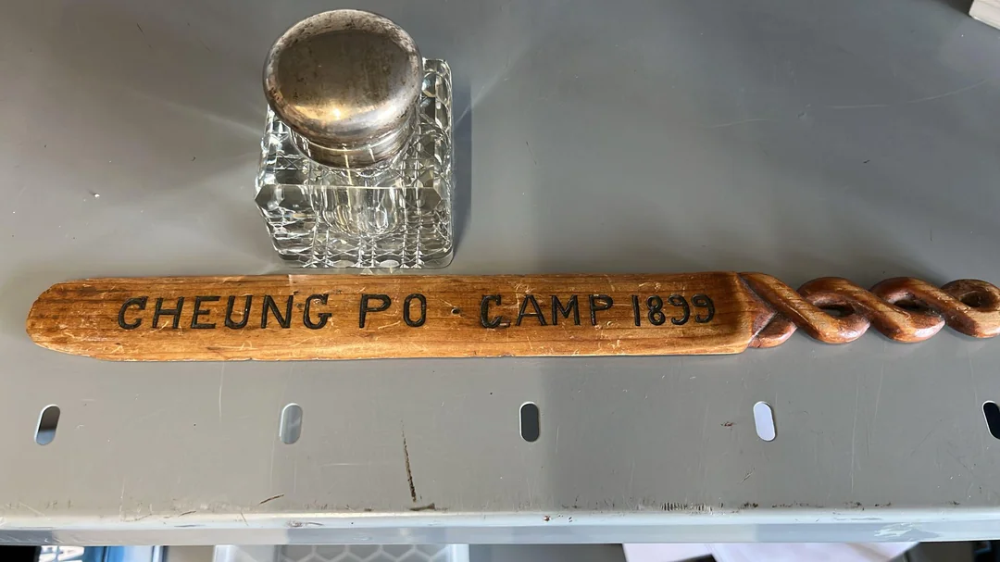
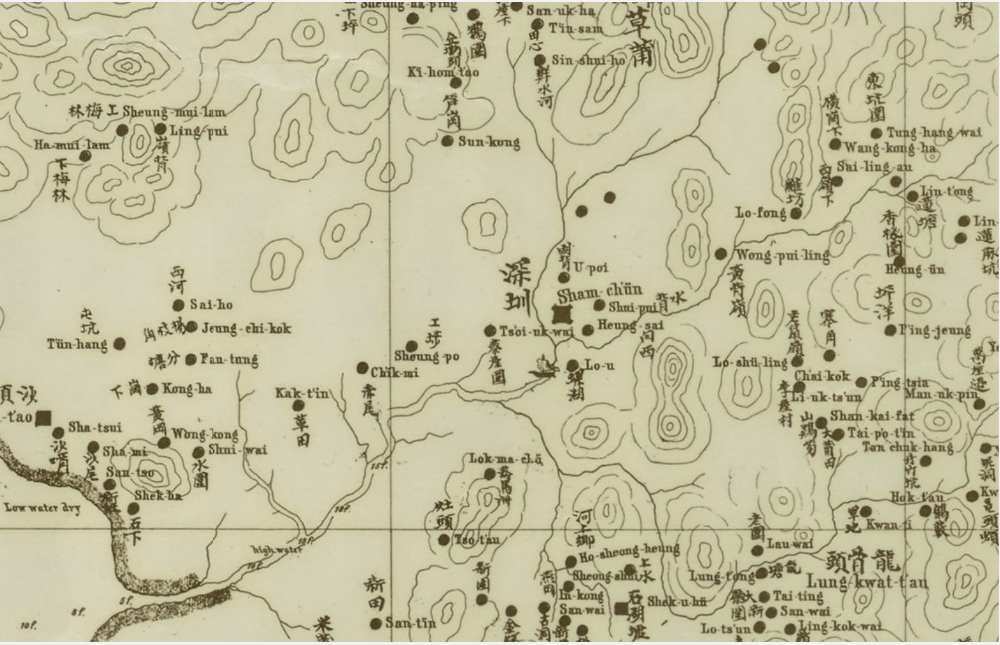

I love it when you find a bug in the world. Not a software bug, but an error in the official story of things. A detail that doesn't quite fit.

A while ago, I stumbled upon one. It started with an old piece of military memorabilia, a small metal artifact stamped with just three words: "Cheung Po 1899." This was posted in a [reddit post](https://www.reddit.com/r/HongKong/comments/1l3t0ik/any_help_identifiying_where_this_came_from_please/). 

The person who found it was asking for help. Where was Cheung Po? No one knew. It's not on any modern map of Hong Kong or Shenzhen. It seemed to be a ghost, a place that existed for a moment and then vanished. It was a dangling pointer. A bug in the historical record. And like any good bug, it hinted that the underlying system was more complex than the documentation suggested.

As so often happens, the bug wasn't in the history itself, but in the data entry. "Cheung Po" was almost certainly a Brit's attempt at writing down a Cantonese name. The most likely candidate was 軍陂 (pronounced roughly *Gwan Po*), a small area just west of the old Shenzhen market—Sham Chun Hui. An 1866 map, drawn by an industrious Italian missionary, confirmed it. There, right next to "Sham Chun," was a place he'd labeled "Sheung Po." We were getting closer. The map can be found in [CUHK's archive](https://repository.lib.cuhk.edu.hk/en/item/cuhk-2612080).

The date, 1899, was the real key. In 1898, Britain had leased a huge tract of land from Qing China, which would become Hong Kong's New Territories. But the local clans living there hadn't been consulted, and they weren't happy about it. When British troops arrived in 1899 to hoist the Union Jack, they were met with armed resistance.

The official story is of a short conflict, after which the new border was established at the Shenzhen River. But the reality on the ground was far messier. To quell the resistance, British-led troops pushed *north* of the agreed-upon border and occupied the market town of Sham Chun. And it was here they set up camp. One of those camps was at Cheung Po.

The final piece of the puzzle came from a historical journal, [quoting a letter](https://www.jstor.org/stable/44229396) from a Major Prendergast, R.E., dated July 1899. Its location? "Cheung Po Camp, Shum Chun." This was our smoking gun. The camp was real. It was a temporary, unauthorized footprint on what was technically still Chinese soil, a product of military necessity that politics would soon erase. The Prime Minister back in London got nervous about the overreach, and the colonial government didn't want the expense of securing more land. The troops were pulled back, the camp was dismantled, and the name "Cheung Po" vanished, surviving only on a few soldiers' souvenirs. The bug was patched.

The quotation reads:

>"The regiment took an active part in the occupation of the New Territories in 1898/1899. Detachments were present at the occupation of Tai Po, and the "battle" of Kam Tin. They also provided the garrison for Shum Chun (north of the present frontier) which was initially occupied for some months. An interesting letter dated 14th July 1899 from Major Prendergast, R.E. in command of the troops at Cheung Po Camp, Shum Chun, comments indirectly on the good discipline of these soldiers and advises against their relief by British soldiers."

Solving this puzzle felt satisfying. But it also felt artisanal. It required one person's curiosity, hours of digging, and a lucky break finding that one journal article. And this is where the story gets really interesting. Because that whole process is about to change.

Imagine training an AI on the millions of pages in the British colonial archives. On every map, hand-drawn or printed. On every ship's log and soldier's letter. You could then treat history not as a story, but as a massive, messy dataset.

You could ask it questions that are currently impossible to answer. "List all place names that appear in 1899 military correspondence but don't appear on official 1900 maps." Cheung Po would pop right out. So would many others, I suspect. You could cross-reference phonetically similar place names across documents written in English, Cantonese, and Hakka, instantly resolving thousands of "Cheung Po" style transliteration errors.

This isn't about replacing historians. It's about giving them a superpower. It automates the most grueling part of their work—the search—and frees them to do what humans do best: ask questions, see patterns, and tell stories.

The story of "Cheung Po" is more than a historical curiosity. It’s a reminder that the past isn’t a fixed narrative, but a vast, largely un-queried database. There are thousands of forgotten stories, contradictions, and bugs lying dormant in the archives. We’re finally building the tools to go find them.